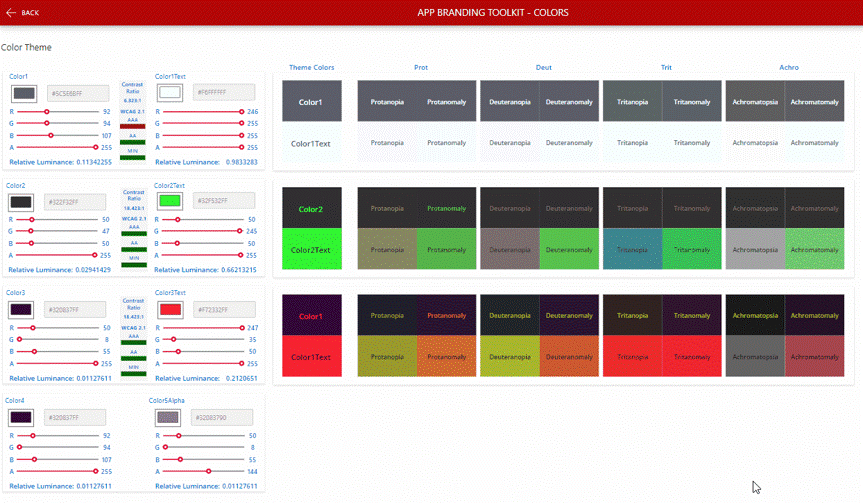

# Accessible Apps Kit

The Accessible Apps Kit has been built by the Trustmarque team to help you get started providing accessible experiences in the Power Platform.

There are a few tools available now with more to come.

## Colour Contrast Checker

This tool lets you play with your company brand colors to check if they are accessible to different types of colourblind users. It shows you what the colour would look like to the follow colourblind conditions:

- Prot
- Deut
- Trit
- Achro

## Icon Picker

TBC